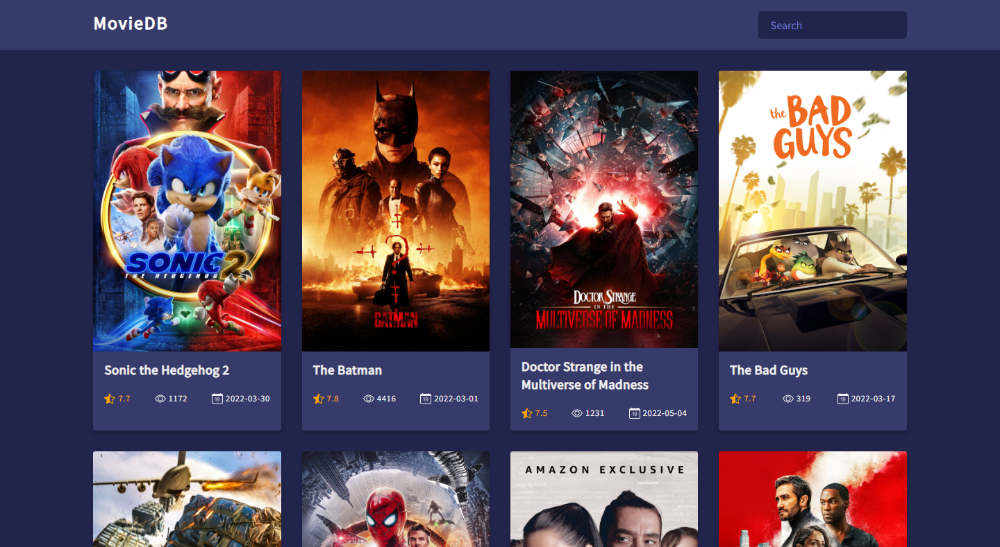

# Movie DB


## Overview

Movie Db is a react app listing some movies retrieve from TheMovieDb api


## Screenshot




## Links

- Source Code : [https://github.com/mooktar/movie-db](https://github.com/mooktar/movie-db)
- Live Site : [https://movie-db-pied.vercel.app/](https://movie-db-pied.vercel.app/)


## Built with

- Semantic HTML5 markup
- CSS Flexbox and Grid
- Mobile-first workflow
- [React](https://reactjs.org/) - JS library


## How to use it

To use this app follow the instruction below:

```shell
git clone https://github.com/mooktar/movie-db.git
cd movie-db
npm install
```

Open your browser and enter [http://localhost:3000](http://localhost:3000/) to see the result.


## Author

- GitHub - [Mooktar](https://github.com/mooktar)
- Twitter - [@mooktar_dev](https://www.twitter.com/mohmouktar)
